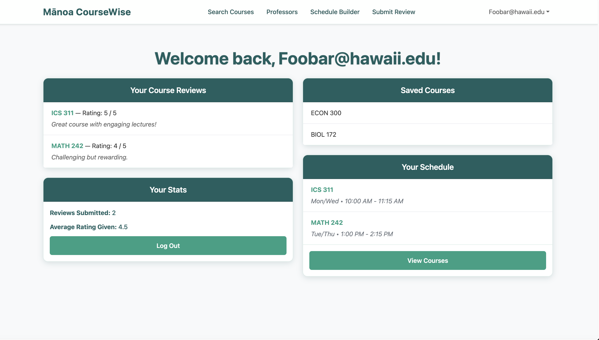
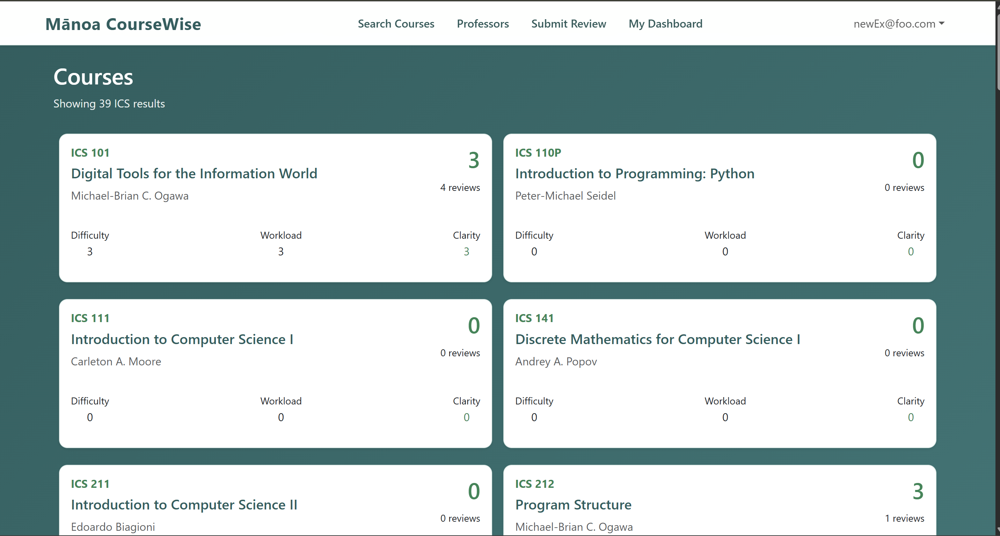
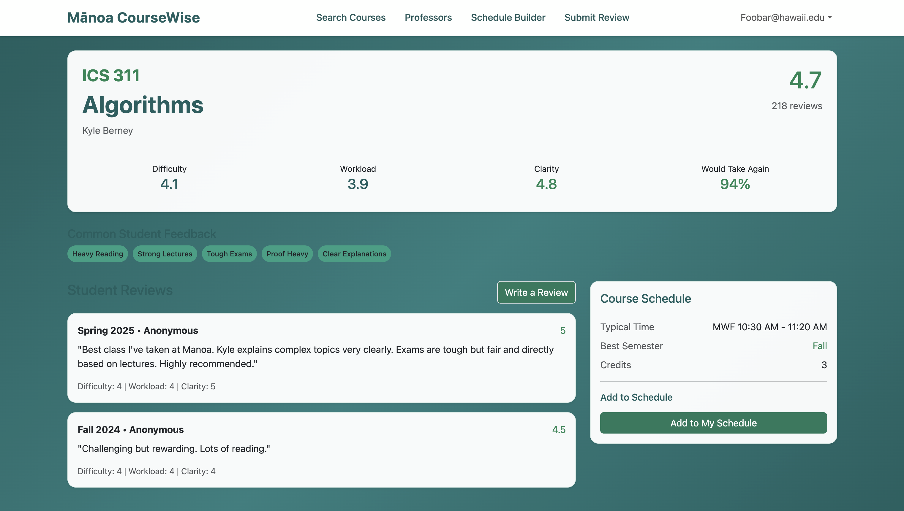
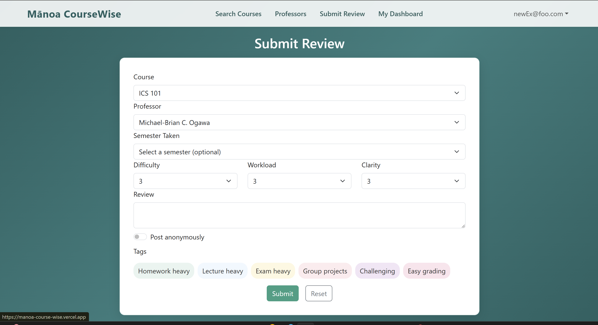

# Mānoa CourseWise
**Honest Course Reviews and Smarter Scheduling for UH Mānoa Students**
[View on GitHub](https://github.com/manoa-coursewise/manoa-course-wise.github.io)

## Table of Contents
- [Project Overview](#project-overview)
- [The Challenge](#the-challenge)
- [Planned Features](#planned-features)
- [Phase 1: Core Review & Search System](#phase-1-core-review--search-system-mvp)
- [User Guide](#user-guide)
- [Use Cases](#use-cases)
- [Team](#team)
- [Team Contract](#team-contract)
- [Milestones](#milestones)
  - [Milestone 1](#milestone-1)
  - [Milestone 2](#milestone-2)
- [Developer Guide](#developer-guide)
- [Deployment](#deployment)
  

## Project Overview
Mānoa CourseWise is a Next.js web application designed to help University of Hawaiʻi at Mānoa students make better, more informed decisions when choosing classes each semester.

## The Challenge
UH Mānoa students often struggle to find reliable information when registering for courses. Tools like RateMyProfessors tend to be too general or overly negative, while official UH systems provide little insight into real difficulty, workload, teaching style, or the best time to take a course. This frequently leads to poor scheduling decisions, unexpected stress, and lower academic performance.

## Planned Features
- Searchable course database with average ratings, difficulty, and workload
- Built-in schedule conflict checker
- Constructive review system with helpful flags
- Personalized recommendations based on user profile
- Persistent data that improves with community contributions

## Phase 1: Core Review & Search System
For the initial implementation, Mānoa CourseWise focuses on building a reliable, constructive review database for UH Mānoa courses and professors while providing basic search and scheduling tools.

### Course & Professor Review System
- Students can browse and search courses by department, course number, or keyword
- Each course page shows average ratings for difficulty, workload, teaching quality, and overall value
- Users can leave structured, constructive reviews with specific categories
- Reviews require basic verification to maintain quality and reduce fake feedback

### Review Submission Features
- Logged-in students can submit reviews including:
  - Numeric ratings (1–5) for difficulty, workload, clarity, and fairness
  - Helpful flags such as “Heavy readings”, “Great lectures”, “Tough exams”, “Group projects”
  - Optional written constructive feedback
  - Best semester recommendation (Fall vs Spring, morning vs evening)
- Students can mark reviews as “Helpful” to surface the best content

### Schedule Conflict Checker
- Simple planner where students can add potential courses
- Instant detection of time conflicts
- Suggestions for alternative courses with similar content or requirements

### Search & Discovery
- Filter courses by department, difficulty level, workload, or rating
- View crowd-sourced “best semester” statistics
- See common warning flags for each course or professor

## Up to Date Pictures of Deployment

### Home / Landing Page

- Upon opening Manoa CourseWise, the user will be brought to the home page. Here, they will be inclined to use the search bar for searching courses, or to select one of the above tabs to freely browse courses, professors, or even submitting a review. However, the act of doing so will immediately redirect to a sign-in page wherethe user either logs in or signs up. 

### User Dashboard

- Here in the user dashboard, the user is now capable of accessing other pages and even viewing their own saved reviews and courses. They can also navigate to the account details page that is accessible from the dropdown menu in order to change/view important account information. 

### Course Search Page

- In this page, the user will be able to freely navigate across all ICS pages with relevant user reviews, ratings, schedule information, tags, and general course information. Selecting a card will bring a user to the course detail page. There is intended searchbar functionality that acts as a filter for certain typed keywords.

### Course Detail Page

- In the course detail page, the user is capable of viewing specific information about a given course as well as see the actual reviews and relevant course information. Only general information such as ratings and tags were truly accessible from the course search page. 

### Submit Review Page

- In the event that a user has already taken a course, they can freely submit a review that allows them to select the specific course, term, and professor while providing feedback on the three specified fields as well as any additional information they feel like providing. A submitted review is immediately accessible from a course detail page, and both the course detail and catalog pages will reflect the change in ratings. 


## Use Cases
- A student searches for “ICS 311” and quickly sees honest feedback on difficulty, workload, and helpful flags
- After finishing a course, a logged-in user submits a constructive review and receives personalized suggestions
- Students build a potential schedule and instantly identify time conflicts with alternatives
- Users mark helpful reviews, gradually improving the quality of information for the entire community

## Team
- [Noah Nguyen](https://noahnguyenbot.github.io/)
- [Ryan Stuckey](https://rystuckey.github.io/)
- [Jaymond Guan](https://jayguan1048.github.io/)
- [Jon Crabtree](https://longnekk.github.io/)

## Team Contract
You can view our **Team Contract** here:  
[📄 Mānoa CourseWise Team Contract](https://docs.google.com/document/d/168F6vcAPAOMeE60Zdiq2MFgVBH58C4DuG1_wfssVZlQ/view)

## Milestones
### Milestone 1
View our **Milestone 1 Project Board** here:  
[🔗 Milestone 1 Progress](https://github.com/orgs/manoa-coursewise/projects/4/views/1)

### Milestone 2
View our **Milestone 2 Project Board** here:  
[🔗 Milestone 2 Progress](https://github.com/orgs/manoa-coursewise/projects/5)

# Developer Guide

## Getting Started

1. **Clone the repository**
   ```bash
   git clone <your-repo-url>
   cd manoa-course-wise
   ```

2. **Install dependencies**
   ```bash
   npm install
   ```

3. **Set up environment variables**
   - Copy `.env.example` to `.env.local` and fill in the required values.

4. **Set up the database (if using Prisma)**
   ```bash
   npx prisma generate
   npx prisma migrate dev
   ```

5. **Run the development server**
   ```bash
   npm run dev
   ```
   - Visit [http://localhost:3000](http://localhost:3000) in your browser.

## Useful Scripts

- `npm run dev` — Start the development server.
- `npm run build` — Build the app for production.
- `npm run start` — Start the production server.
- `npm run lint` — Run ESLint.
- `npm run seed` — Seed the database.
- `npm run import:ics` — Import ICS courses from CSV.

## Project Structure

- `src/app/` — Main Next.js app directory.
- `src/components/` — Reusable React components.
- `prisma/` — Prisma schema and migrations.
- `data/` — Static data files (e.g., CSV).
- `public/` — Static assets.

## Testing

- Playwright tests are in the `tests/` directory.
- Run tests with:
  ```bash
  npm run playwright
  ```


## Deployment (Vercel)

This project is designed for seamless deployment on [Vercel](https://vercel.com/):

1. **Push your changes to GitHub (or your Git provider).**
2. **Connect your repository to Vercel** (if not already done).
3. **Set up environment variables** in the Vercel dashboard (Settings > Environment Variables).
4. **Vercel will automatically build and deploy your app** on every push to the main branch (or any branch you configure).

You do not need to manually run `npm run build` or `npm run start` for Vercel deployments—Vercel handles this automatically in the cloud.

For local production testing (optional):
```bash
npm run build
npm run start
```

## Troubleshooting

- If you see `command not found: next`, run `npm install`.
- If you change the Prisma schema, run:
  ```bash
  npx prisma generate
  npx prisma migrate dev
  ```


---

## Deployment
**Live Demo:** [https://manoa-course-wise.vercel.app/](https://manoa-course-wise.vercel.app/)

*Last updated: April 2026*  
This site will evolve as the Mānoa CourseWise project progresses.


