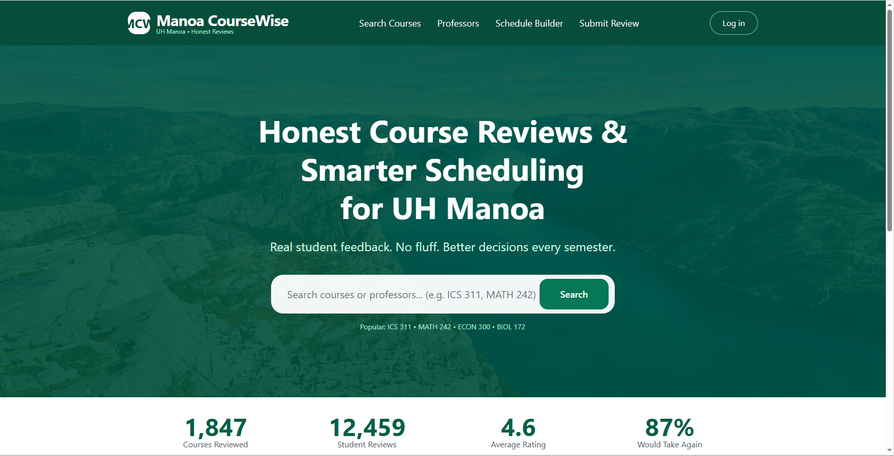
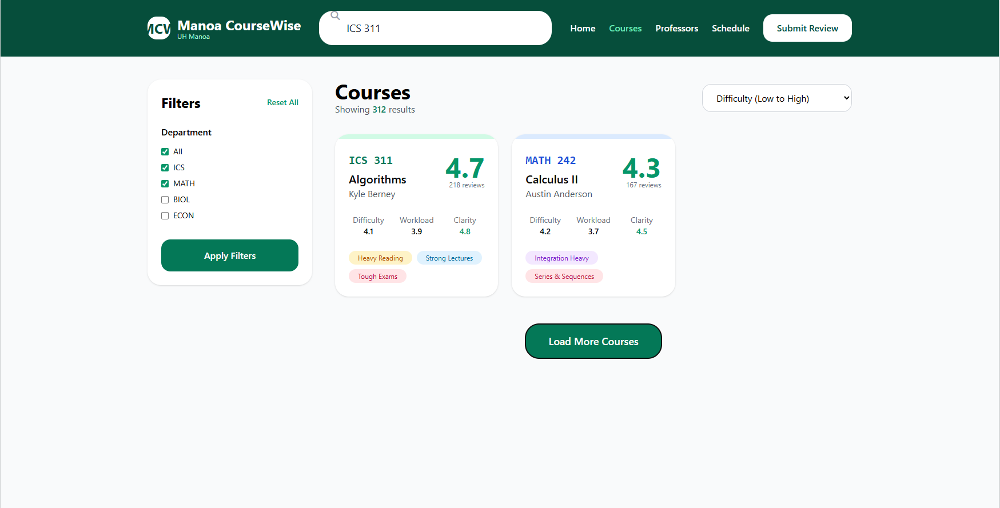
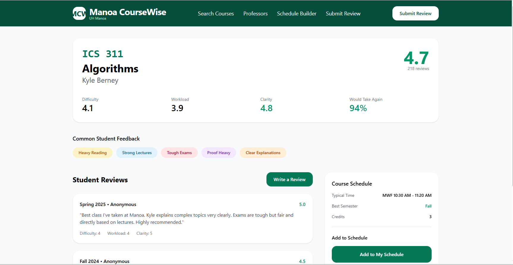
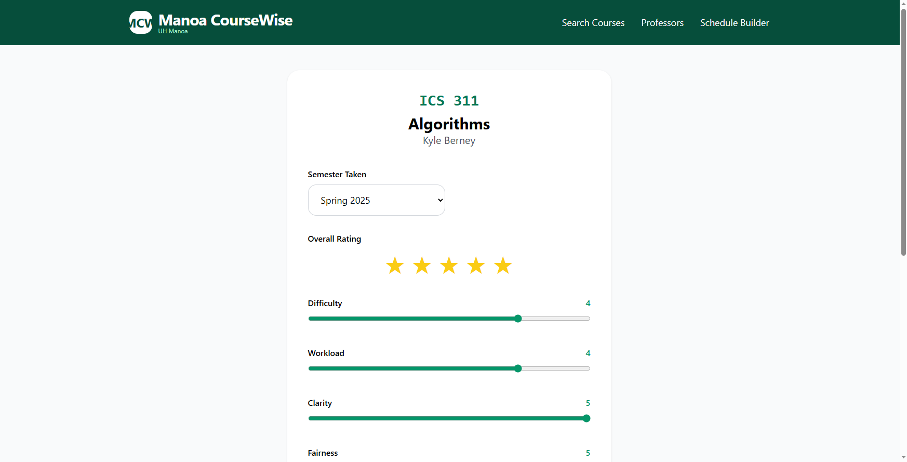
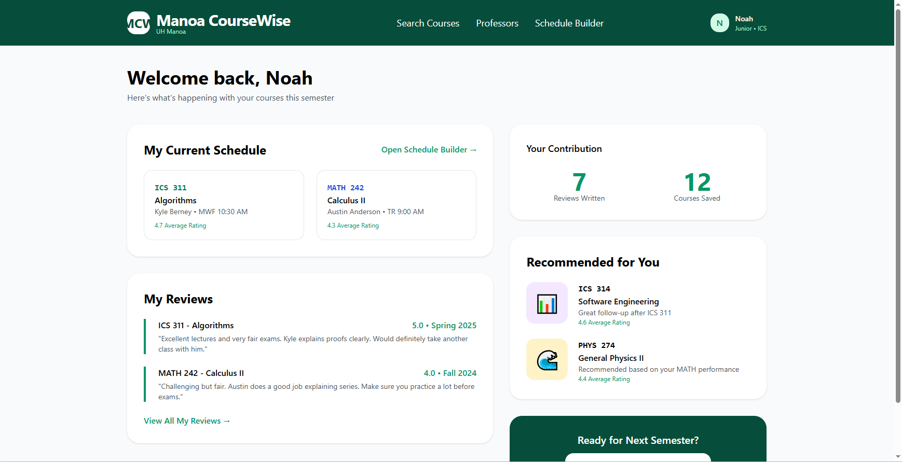

# Mānoa CourseWise

**Honest Course Reviews and Smarter Scheduling for UH Mānoa Students**

[View on GitHub](https://github.com/manoa-coursewise/manoa-course-wise.github.io)

## Table of Contents
- [Project Overview](#project-overview)
- [The Challenge](#the-challenge)
- [Planned Features](#planned-features)
- [Phase 1: Core Review & Search System](#phase-1-core-review--search-system-mvp)
- [Mockup Pages](#mockup-pages)
- [Use Cases](#use-cases)
- [Team](#team)

## Project Overview
Mānoa CourseWise is a Next.js web application designed to help University of Hawaiʻi at Mānoa students make better, more informed decisions when choosing classes each semester.

## The Challenge
UH Mānoa students often struggle to find reliable information when registering for courses. Tools like RateMyProfessors tend to be too general or overly negative, while official UH systems provide little insight into real difficulty, workload, teaching style, or the best time to take a course. This frequently leads to poor scheduling decisions, unexpected stress, and lower academic performance.

## Planned Features
- Searchable course database with average ratings, difficulty, and workload
- Built-in schedule conflict checker
- Constructive review system with helpful flags
- Personalized recommendations based on user profile
- Persistent data that improves with community contributions

## Phase 1: Core Review & Search System 

For the initial implementation, Mānoa CourseWise focuses on building a reliable, constructive review database for UH Mānoa courses and professors while providing basic search and scheduling tools.

### Course & Professor Review System
- Students can browse and search courses by department, course number, or keyword
- Each course page shows average ratings for difficulty, workload, teaching quality, and overall value
- Users can leave structured, constructive reviews with specific categories
- Reviews require basic verification to maintain quality and reduce fake feedback

### Review Submission Features
- Logged-in students can submit reviews including:
  - Numeric ratings (1–5) for difficulty, workload, clarity, and fairness
  - Helpful flags such as “Heavy readings”, “Great lectures”, “Tough exams”, “Group projects”
  - Optional written constructive feedback
  - Best semester recommendation (Fall vs Spring, morning vs evening)

- Students can mark reviews as “Helpful” to surface the best content

### Schedule Conflict Checker
- Simple planner where students can add potential courses
- Instant detection of time conflicts
- Suggestions for alternative courses with similar content or requirements

### Search & Discovery
- Filter courses by department, difficulty level, workload, or rating
- View crowd-sourced “best semester” statistics
- See common warning flags for each course or professor

## Mockup Pages

### Home / Landing Page
Hero banner with UH Mānoa branding and prominent search bar.

### Course Search Page
Filterable grid showing courses with average ratings and key statistics.

### Course Detail Page
Reviews list, statistics, flags, and schedule conflict checker.

### Submit Review Page
Form with ratings, sliders, and flag selection.

### User Dashboard
Personalized recommendations, my reviews, and saved courses.

## Use Cases
- A student searches for “ICS 311” and quickly sees honest feedback on difficulty, workload, and helpful flags
- After finishing a course, a logged-in user submits a constructive review and receives personalized suggestions
- Students build a potential schedule and instantly identify time conflicts with alternatives
- Users mark helpful reviews, gradually improving the quality of information for the entire community

## Team

- [Noah Nguyen](https://noahnguyenbot.github.io/)  
- [Ryan Stuckey](https://rystuckey.github.io/)  
- [Jaymond Guan](https://jayguan1048.github.io/)  
- [Jon Crabtree](https://longnekk.github.io/)

## Team Contract
You can view our **Team Contract** here:  
[📄 Mānoa CourseWise Team Contract](https://docs.google.com/document/d/168F6vcAPAOMeE60Zdiq2MFgVBH58C4DuG1_wfssVZlQ/view)

## Milestone 1
View our **Milestone 1 Project Board** here:  
[🔗 Milestone 1 Progress](https://github.com/orgs/manoa-coursewise/projects/4/views/1)

## Milestone 2
View our **Milestone 2 Project Board** here:  
[🔗 Milestone 2 Progress](https://github.com/orgs/manoa-coursewise/projects/5/views/1)

## Deployment
**Live Demo:** [https://manoa-course-wise.vercel.app/](https://manoa-course-wise.vercel.app/)

---

*Last updated: April 2026*  
This site will evolve as the Mānoa CourseWise project progresses.

