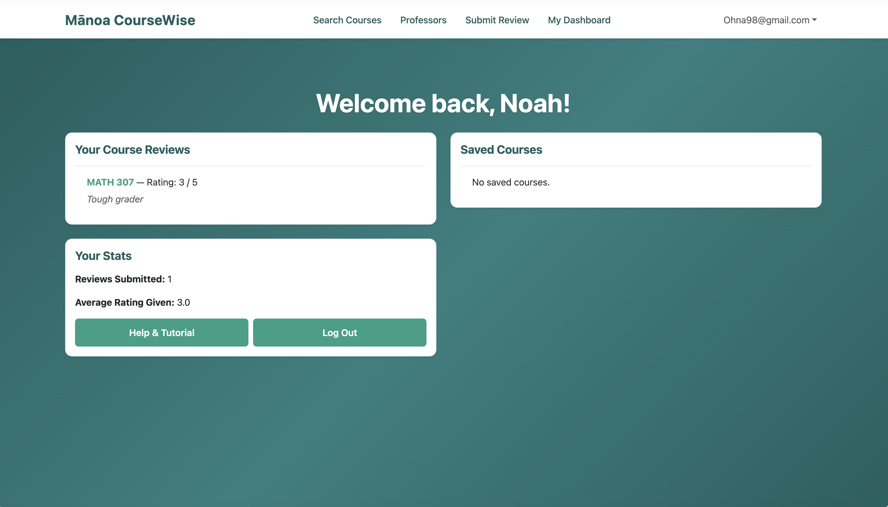

# Mānoa CourseWise
**Honest Course Reviews and Smarter Scheduling for UH Mānoa Students**
[View on GitHub](https://github.com/manoa-coursewise/manoa-course-wise.github.io)

## Table of Contents
- [Project Overview](#project-overview)
- [The Challenge](#the-challenge)
- [User Guide](#user-guide)
- [Use Cases](#use-cases)
- [Team](#team)
- [Team Contract](#team-contract)
- [Milestones](#milestones)
  - [Milestone 1](#milestone-1)
  - [Milestone 2](#milestone-2)
  - [Milestone 3](#milestone-3)
- [Developer Guide](#developer-guide)
- [Community Feedback](#community-feedback)
- [Effort Report](#effort-report)
- [Deployment](#deployment)
  

## Project Overview
Mānoa CourseWise is a Next.js web application designed to help University of Hawaiʻi at Mānoa students make better, more informed decisions when choosing classes each semester.

## The Challenge
UH Mānoa students often struggle to find reliable information when registering for courses. Tools like RateMyProfessors tend to be too general or overly negative, while official UH systems provide little insight into real difficulty, workload, teaching style, or the best time to take a course. This frequently leads to poor scheduling decisions, unexpected stress, and lower academic performance.


### Course & Professor Review System
- Students can browse and search courses by professor, course number, or keyword
- Each course page shows average ratings for difficulty, workload, and clarity
- Users can leave structured, constructive reviews


### Review Submission Features
- Logged-in students can submit reviews including:
  - Numeric ratings (1–5) for difficulty, workload, and clarity
  - Helpful flags such as “Heavy readings”, “Great lectures”, “Tough exams”, “Group projects”
  - Optional written constructive feedback


## User Guide

### Home / Landing Page

- Upon opening Manoa CourseWise, the user will be brought to the home page. Here, they will be inclined to use the search bar for searching courses, or to select one of the above tabs to freely browse courses, professors, or even submitting a review. However, the act of doing so will immediately redirect to a sign-in page wherethe user either logs in or signs up.
  
### Sign Up / Sign In Page

**Sign Up Form**  


**Sign In Form**  


- To sign up, click the “Sign Up” link and fill out the form with your desired username, email, and password.  
- After registering, you can sign in by entering either your username or email along with your password on the “Sign In” page.  
- If you have trouble signing in, double-check your credentials.
- username and password are case senstive!
- If you have trouble signing up someone might already be using your email or username
### User Dashboard

- Here in the user dashboard, the user is now capable of accessing other pages and even viewing their own saved reviews and courses. They can also navigate to the account details page that is accessible from the dropdown menu in order to change/view important account information. 

### Course Search Page

- On this page, users can browse and search for both ICS and Math courses using the search bar and filter options. The search bar allows users to quickly find courses by typing keywords, while the filter lets them narrow results to either ICS or Math courses. Each course card displays user reviews, ratings, tags, and general course information. Selecting a card takes the user to the detailed course page for more information.

### Course Detail Page

- In the course detail page, the user is capable of viewing specific information about a given course as well as see the actual reviews and relevant course information. Only general information such as ratings and tags were truly accessible from the course search page.
  
### Professors Page

- The Professors page displays a list of all professors associated with courses in the system. Users can view which professors teach which courses, helping them identify instructors for specific classes and explore course offerings by professor. The page also provides options to sort the list alphabetically by professor name or by course code for easier navigation.
  
### Submit Review Page

- In the event that a user has already taken a course, they can freely submit a review that allows them to select the specific course, term, and professor while providing feedback on the three specified fields as well as any additional information they feel like providing. A submitted review is immediately accessible from a course detail page, and both the course detail and catalog pages will reflect the change in ratings. 


## Use Cases
- A student searches for “ICS 311” and quickly sees honest feedback on difficulty, workload, and helpful flags
- After finishing a course, a logged-in user submits a constructive review and receives personalized suggestions
- Users mark helpful reviews, gradually improving the quality of information for the entire community

## Team
- [Noah Nguyen](https://noahnguyenbot.github.io/)
- [Ryan Stuckey](https://rystuckey.github.io/)
- [Jaymond Guan](https://jayguan1048.github.io/)
- [Jon Crabtree](https://longnekk.github.io/)

## Team Contract
You can view our **Team Contract** here:  
[📄 Mānoa CourseWise Team Contract](https://docs.google.com/document/d/168F6vcAPAOMeE60Zdiq2MFgVBH58C4DuG1_wfssVZlQ/view)

## Milestones
### Milestone 1
View our **Milestone 1 Project Board** here:  
[🔗 Milestone 1 Progress](https://github.com/orgs/manoa-coursewise/projects/4/views/1)

### Milestone 2
View our **Milestone 2 Project Board** here:  
[🔗 Milestone 2 Progress](https://github.com/orgs/manoa-coursewise/projects/5)

### Milestone 3
View our **Milestone 3 Project Board** here:  
[🔗 Milestone 3 Progress](https://github.com/orgs/manoa-coursewise/projects/6)

# Developer Guide

## Getting Started

1. **Clone the repository**
   ```bash
   git clone <your-repo-url>
   cd manoa-course-wise
   ```

2. **Install dependencies**
   ```bash
   npm install
   ```

3. **Set up environment variables**
   - Copy `.env.example` to `.env.local` and fill in the required values.

4. **Set up the database (if using Prisma)**
   ```bash
   npx prisma generate
   npx prisma migrate dev
   ```

5. **Run the development server**
   ```bash
   npm run dev
   ```
   - Visit [http://localhost:3000](http://localhost:3000) in your browser.

## Useful Scripts

- `npm run dev` — Start the development server.
- `npm run build` — Build the app for production.
- `npm run start` — Start the production server.
- `npm run lint` — Run ESLint.
- `npm run seed` — Seed the database.
- `npm run import:ics` — Import ICS courses from CSV.

## Project Structure

- `src/app/` — Main Next.js app directory.
- `src/components/` — Reusable React components.
- `prisma/` — Prisma schema and migrations.
- `data/` — Static data files (e.g., CSV).
- `public/` — Static assets.

## Testing

- Playwright tests are in the `tests/` directory.
- Run tests with:
  ```bash
  npm run playwright
  ```


## Deployment (Vercel)

This project is designed for seamless deployment on [Vercel](https://vercel.com/):

1. **Push your changes to GitHub (or your Git provider).**
2. **Connect your repository to Vercel** (if not already done).
3. **Set up environment variables** in the Vercel dashboard (Settings > Environment Variables).
4. **Vercel will automatically build and deploy your app** on every push to the main branch (or any branch you configure).

You do not need to manually run `npm run build` or `npm run start` for Vercel deployments—Vercel handles this automatically in the cloud.

For local production testing (optional):
```bash
npm run build
npm run start
```

## Troubleshooting

- If you see `command not found: next`, run `npm install`.
- If you change the Prisma schema, run:
  ```bash
  npx prisma generate
  npx prisma migrate dev
  ```


---

# Community Feedback

## Feedback #1

- The dashboard UI is clean and easy to navigate, but some sections (like saved courses) could use more visual distinction or icons for quick scanning.
- When submitting a review, there’s no confirmation message—users might not be sure if their input was saved.
- The course search is fast, but filtering by professor sometimes returns unexpected results (e.g., partial matches).
- It would be helpful to have a “recently viewed” or “recommended courses” section based on user activity.

## Feedback #2

- The navigation is intuitive, and the dashboard loads quickly, making it easy to find key features.
- The color scheme is visually appealing, but some text (like on buttons) could use higher contrast for better readability.
- The course search and filter options are responsive, but filtering by professor sometimes returns too many unrelated results.
- The review submission process is straightforward, but a confirmation message after submitting would reassure users that their input was received.

## Feedback #3

- The dashboard is easy to navigate, and the main features are accessible from the homepage.
- Some error messages are generic; more descriptive errors would help users understand what went wrong.
- The site’s performance is good overall, but there’s a slight delay when loading course details.

## Feedback #4

- The overall design is modern and clean, making the site pleasant to use.
- It would be useful to have a “recently viewed courses” feature for quick access.
- The logout button is easy to find, but it could provide a confirmation or redirect after logging out.

## Feedback #5

- Consider adding a “favorites” or “bookmark” feature so users can quickly access courses or professors they’re interested in.
- A notification system for new reviews or updates would help keep users engaged and informed.
- Allow users to sort or filter reviews by date, rating, or course for easier browsing.
- Adding brief tooltips or help icons next to key features would make the site more user-friendly for first-time visitors.

---
## Effort Report
**[View Project Effort Report Spreadsheet](https://docs.google.com/spreadsheets/d/e/2PACX-1vSBFOU6XrWLT51cYYFXnYbJAFS6WH1uHKYvJTJHgpXaKJuV5vtrwwkJO_S0hnMQT1b3OvLwl_ohAaxx/pubhtml)**

## Deployment
**Live Demo:** [https://manoa-course-wise.vercel.app/](https://manoa-course-wise.vercel.app/)

*Last updated: April 2026*  
This site will evolve as the Mānoa CourseWise project progresses.


